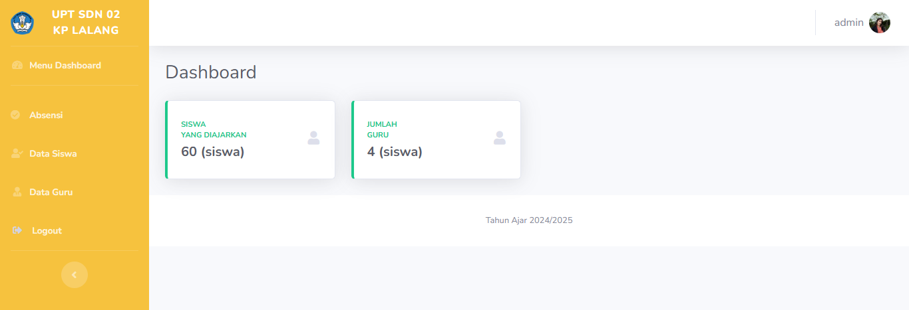

<p align="center">

</p>

# Siswa Management System

## Table of Contents
- [Project Description](#project-description)
- [Features](#features)
- [Technologies Used](#technologies-used)
- [Installation](#installation)
- [Usage](#usage)
- [Contributing](#contributing)
- [License](#license)

## Project Description
The **Siswa Management System** is a simple web-based application designed to manage student data efficiently. The application allows users to perform CRUD (Create, Read, Update, Delete) operations on student records, including filtering by class and gender. This project is built with PHP and MySQL and focuses on providing a user-friendly interface for school administrators.

## Features
- Add new student records.
- View and filter student data by class or gender.
- Update existing student details.
- Delete student records.
- Prevent duplicate student entries in the same class.
- Responsive design for easy access on multiple devices.

## Technologies Used
- **Frontend**: HTML, CSS, JavaScript
- **Backend**: PHP
- **Database**: MySQL

## Installation
1. Clone the repository:
   ```bash
   git clone https://github.com/leo-lifecode/absenSiswaPHP.git
   ```
2. Navigate to the project directory:
   ```bash
   cd absenSiswaPHP
   ```
3. Set up the database:
   - Import the `database.sql` file into your MySQL database.
   - Update the `koneksi.php` file with your database credentials.
4. Start a local PHP server:
   ```bash
   php -S localhost:8000
   ```
5. Open the application in your browser:
   ```
   http://localhost:8000
   ```

## Usage
1. Navigate to the homepage to view the list of students.
2. Use the "Add Student" form to create a new student record.
3. Edit or delete student records using the respective buttons.
4. Use filters to view students by class or gender.

## Contributing
Contributions are welcome! Please fork the repository and submit a pull request with your changes.

## License
This project is licensed under the MIT License. See the LICENSE file for details.

---

Developed with ❤️ by leolife.

